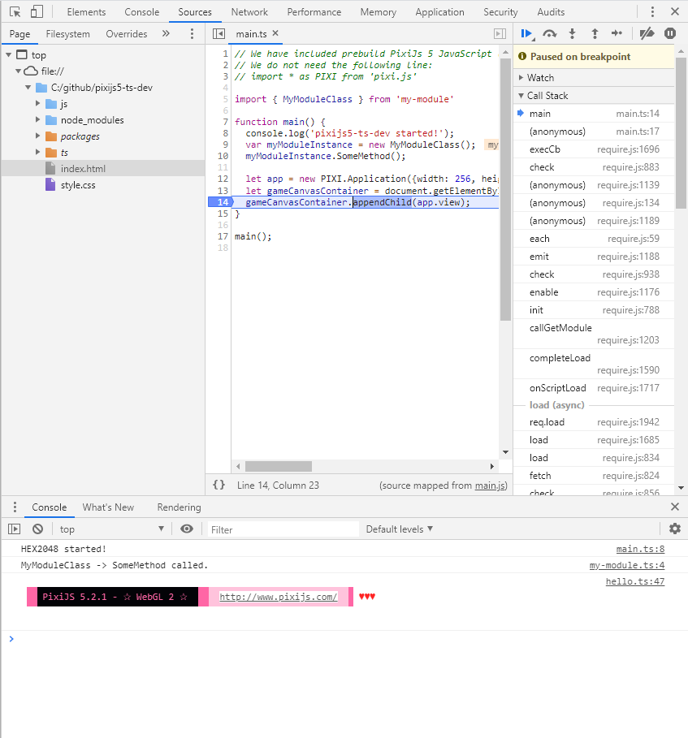

# pixijs5-ts-dev
Example of how to setup PixiJS 5 and Typescript development configuration for easy debugging and fast building.

#### Setup

```sh
npm install
```

It will install PixiJS 5 and RequireJs into node_modules folder.
It is supposed that you have Typescript installed globally.

### Motivation ###

This setup does not suit for production. For production it is better to install something like Webpack:
[PIXI 5, TypeScript & Webpack - Basic Setup](https://goodgecko.co.uk/pixi-typescript-webpack.html)

But after installing Webpack your simple "Hello, world!" application will take about 40K of lines.
Besides, you have to debug using traces that show only the line of error.
In this setup, you have a normal Typescipt debugger and the rebuilding app is instantaneous!


